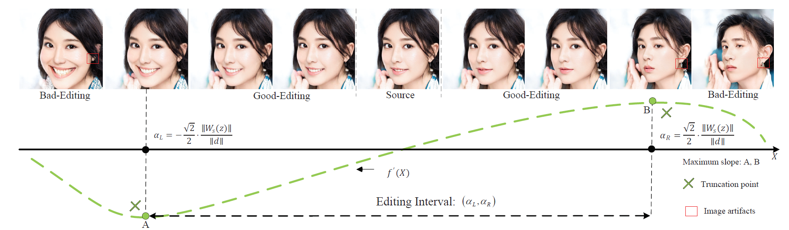

# Elastic
A Subspace-based Method for Facial Image Editing

# The trade-off between image reconstruction and editing

 

The editing results along f′(X). MST finds A and B, which have maximum absolute slope values. Its corresponding editing interval is (αL, αR). Image artifacts are labeled with a red box in poorly edited images.

# The Framework of proposed AWM and MST

Fig.2 The framework of the proposed method with two stages, i.e., adaptive weight modulation and slope truncation. The former aims to determine the parameters of subspace. The latter intends to derive an editing interval to perform safe and controllable editing. Facial image generation and editing are conducted with subspace parameters in Stage 2.

# Real image embedding and editing based on subspace

Fig.3 Performing real facial image editing with parameters of subspace. For each example, the user sequentially changes the pose, age, glasses, eyes closed, smile, and surprise of the real images. The raw image is embedded in StyleGAN2 latent space using DNI, which results in an inverted image.
